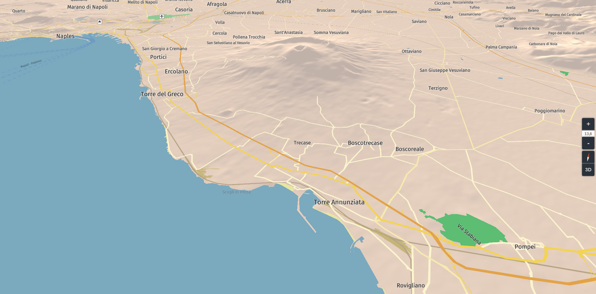

# harpbox

## Demo

[harpbox.surge.sh](https://harpbox.surge.sh)

## Description

A [harp.gl](harp.gl) map implementing terrain by using the [Mapbox RGB terrain provider](https://docs.mapbox.com/help/troubleshooting/access-elevation-data/#mapbox-terrain-rgb).



:warning: The code is basic and does not support the sphere projection.

:warning: This terrain is **only** a mesh underlayed in render order below the vector data. The vector data is **not** elevated and does not know at all about the elevation.

Elevation of vector data should be implemented in the current OmvDataSource of harp.gl instead (see that project). This is more of a demo mixing the harp suite with Mapbox RGB tiles for the moment.

## Installation

```
git clone git@github.com:Astrak/harpbox.git
cd harpbox
yarn
yarn start
```

## Known issues

From this repo:

-   Elevating vertices on a plane results in an overall diagonal pattern following the triangles orientation of the mesh.
-   The algorithm reading the height fails to read or assign the last row of vertices and the south edge of the terrain tiles falls below the surface.
-   The terrain meshes' boundaries don't fit with their neighbours.

Compliance problems with harp.gl:

-   The elevation cannot be transfered to the vector data decoded in Omv. The code in this repo should be plugged into the harp's OmvDataSource so that the height data is sampled for each vector feature, either by the team (possibly ongoing with internal non-Mapbox and non-RGB terrain) or in a forked OmvDataSource.
-   The near culling plane of the camera culls the mountains at higher zoom levels.
